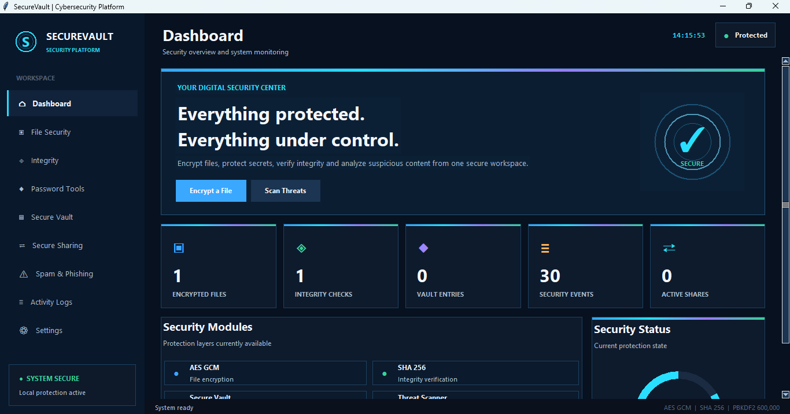

# SecureVault

SecureVault is a Python based desktop cybersecurity application that combines password management, password analysis, threat detection, file security, secure storage, sharing, and activity monitoring in one modern interface.

## Features

• 🔐 **Password Generator**
Generate strong passwords with customizable length, letters, numbers, and symbols.

• 🛡️ **Password Analyzer**
Check password strength, character diversity, weak patterns, and security recommendations.

• 🚨 **Threat Detection**
Analyze suspicious messages, links, spam, phishing indicators, and potentially dangerous content.

• 📁 **File Security**
Perform security related operations for sensitive files.

• 🔒 **Secure Vault**
Store passwords, notes, and other sensitive information using the application's security mechanisms.

• 📊 **Activity Logs**
Monitor security related actions and application events.

• 🔗 **Secure Sharing**
Support controlled sharing of protected information.

• 💻 **Modern UI**
Dark cybersecurity theme with animated backgrounds, cyber grid effects, blue and cyan accents, cards, and responsive layouts.

## Technology Stack

| Technology   | Purpose                            |
| ------------ | ---------------------------------- |
| Python       | Application development            |
| Tkinter      | Desktop interface                  |
| SQLite       | Local data storage                 |
| Cryptography | Encryption and security operations |

## Installation

```bash
git clone https://github.com/fatimareeb2127-bit/SecureVault.git
cd SecureVault
pip install cryptography
python main.py
```

On Windows:

```powershell
py main.py
```

## Project Structure

```text
SecureVault/
├── main.py
├── crypto/
├── security/
├── database/
├── vault/
├── sharing/
└── README.md
```

## Security

SecureVault focuses on:

• Encryption of sensitive information
• Strong password practices
• Local data protection
• Threat awareness
• Security activity monitoring

## Future Improvements

• Two factor authentication
• Biometric authentication
• Password breach checking
• Advanced phishing detection
• Malware scanning
• Encrypted cloud backup
• Security reports
• Improved file sharing


### Home Dashboard



## Disclaimer

SecureVault is an educational and defensive cybersecurity project. 
